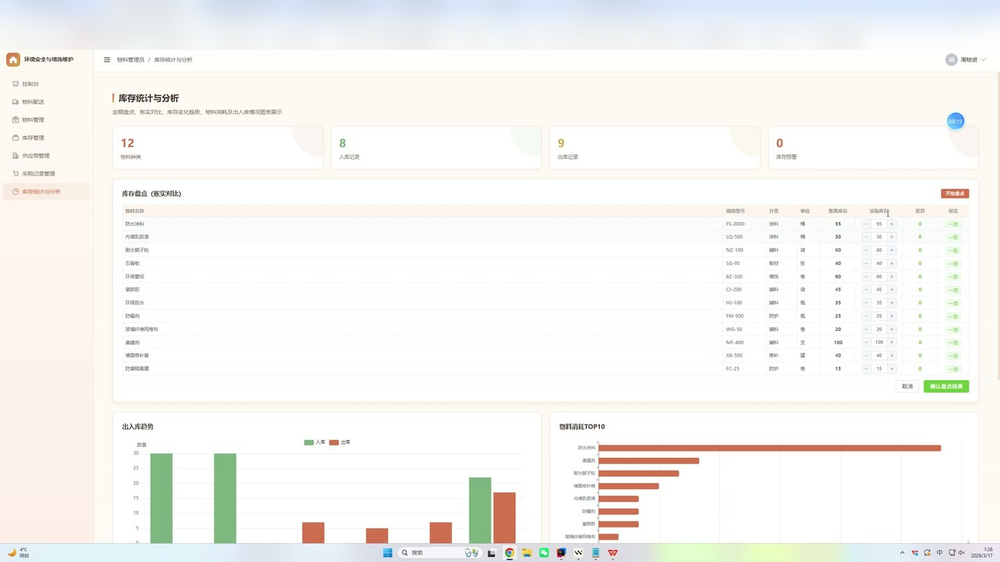
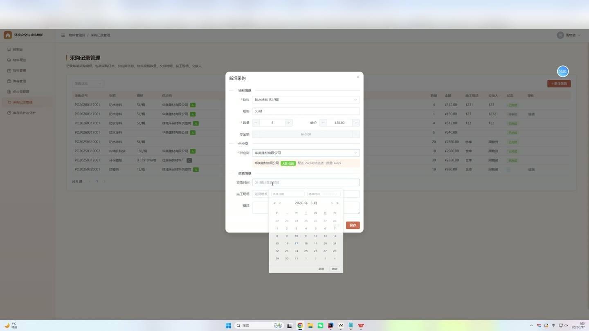
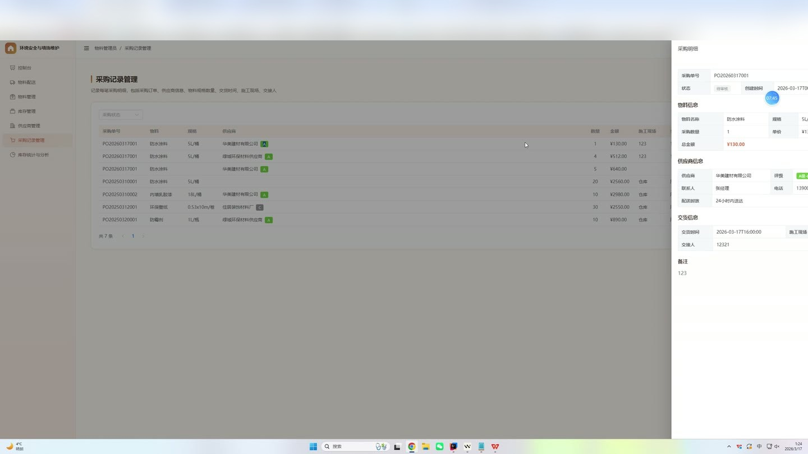
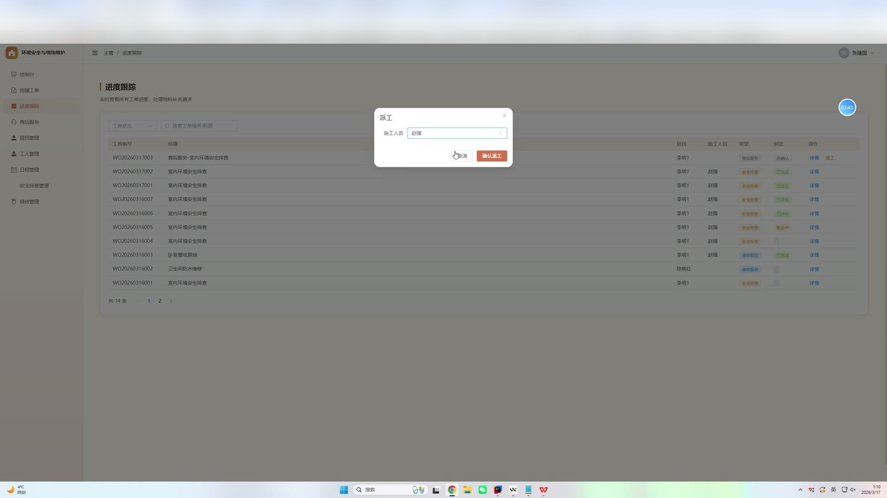
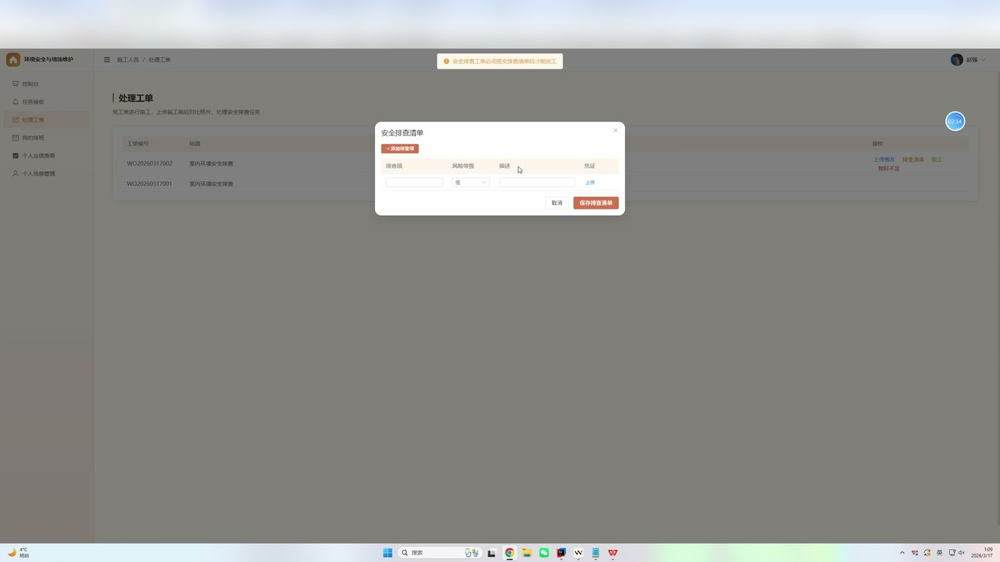
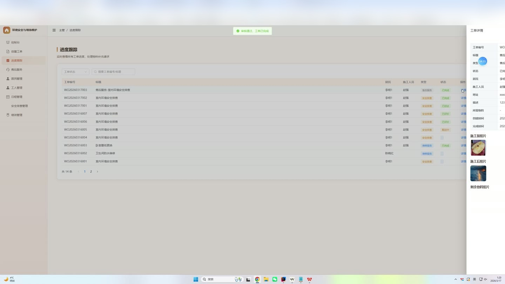

# (附文档)Springboot3+Vue3+MySQL 室内环境安全与墙饰维护系统

**技术栈**：Springboot3、Vue3、MySQL

### 系统简介

本系统为室内环境安全与墙饰维护提供全流程数字化管理平台，采用前后端分离架构（Spring Boot 3 + Vue 3），涵盖居民、主管、施工员、物料管理员四个角色。系统围绕工单流转、物料采购与库存、安全排查、预约管理、售后评价、人员排班及绩效评估等核心业务，实现从报修预约、派工施工、物料配送、完工审核到售后评价的闭环管理。
 
### 核心功能
 
### 普通用户端

 
- 注册与登录：使用用户名密码注册新账号，登录后获取 JWT Token 并跳转至仪表盘。 
- 预约服务：提交上门预约申请，填写类型、项目名称、描述、预约时间、地址，系统自动校验所选时间前后 2 小时是否冲突。 
- 查看我的预约：分页查看本人提交的所有预约记录，按创建时间倒序排列。 
- 工单查看：查看本人相关的工单列表，支持按状态和类型筛选，展示工单编号、标题、地址、状态、施工人员等信息。 
- 工单评价：对已完成的工单进行评分（1-5 分）并填写评价内容，提交后工单状态变为“已评价”。 
- 售后申请：针对已完成工单提交售后申请，填写描述并上传照片，申请后状态为“待审核”。 
- 查看我的售后：分页查看本人提交的售后申请记录，包含关联工单标题、编号及当前状态。 
- 个人信息管理：查看和修改个人资料（真实姓名、电话、头像等），支持修改登录密码（需验证原密码）。
 
### 管理员端

 
- 用户管理：分页查询所有用户，按角色/关键字筛选，支持新增用户（默认密码 123456）、编辑用户信息、启用/禁用账号、删除用户。 
- 工单管理：查看全部工单列表，支持按状态、类型、关键字（标题/工单号）筛选；创建新工单并自动生成工单号；编辑工单信息；派工给指定施工员。 
- 工单状态流转：支持派工、物料确认、施工确认、完工审核、退回等操作；完工审核通过后自动将剩余物料回收入库。 
- 预约审核：查看所有预约申请，按状态和类型筛选；审核通过或驳回预约（驳回时需填写原因）。 
- 售后审核：查看所有售后申请，按状态筛选；审核通过后自动生成售后工单并可选派工；支持驳回售后申请。 
- 物料管理：对物料进行增删改查，支持按关键字（名称/型号）搜索；查看库存不足物料列表（库存  
### 施工员端

 
- 我的工单：查看分配给本人的工单列表，支持按状态和类型筛选；查看工单详情（含居民信息、地址、工单描述等）。 
- 工单操作：上传施工前/施工后/剩余物料照片；上报物料不足（填写短缺报告、照片和描述），工单状态变为“物料不足”；确认施工完成，提交审核。 
- 查看我的排班：按日期范围查看本人的排班计划，按日期升序排列。 
- 查看我的绩效：查看本人的绩效考核记录列表。
 
### 物料管理员端

 
- 物料管理：查看物料列表，按关键字搜索；新增、编辑、删除物料信息。 
- 供应商管理：查看供应商列表，按关键字和等级筛选；新增、编辑、删除供应商。 
- 采购管理：创建采购记录，选择供应商和物料；更新采购状态，采购完成时自动入库。 
- 库存管理：查看库存流水，按出入库类型和物料筛选；手动创建入库/出库记录。 
- 配送管理：查看配送任务，按状态筛选；创建配送任务；更新配送状态。 
- 库存统计：查看入库/出库次数、物料种类数、库存不足物料数量。
 
### 技术栈

 后端框架Spring Boot 3.2 ORMMyBatis-Plus 3.5.5 权限认证JWT（jjwt 0.12.5） 密码加密BCryptPasswordEncoder（Spring Security Crypto） 前端框架Vue 3（Composition API） 状态管理Pinia 前端路由Vue Router 4 构建工具Vite UI 组件库Element Plus HTTP 客户端Axios 数据库MySQL 8 数据库连接池HikariCP JSON 处理Jackson Lombok数据模型简化
 
### 交付内容

 
- 后端完整源码 
- 前端完整源码 
- 数据库初始化脚本 
- 万字文档

## 界面展示

---

## 获取完整源码 + 万字文档

本仓库为项目介绍页。**完整前后端源码、数据库初始化脚本、万字项目文档**，请加微信 `kangkangcode`，或访问 [codekk.top](http://codekk.top) 获取。

可作课程设计 / 毕业设计参考，支持远程部署调试。